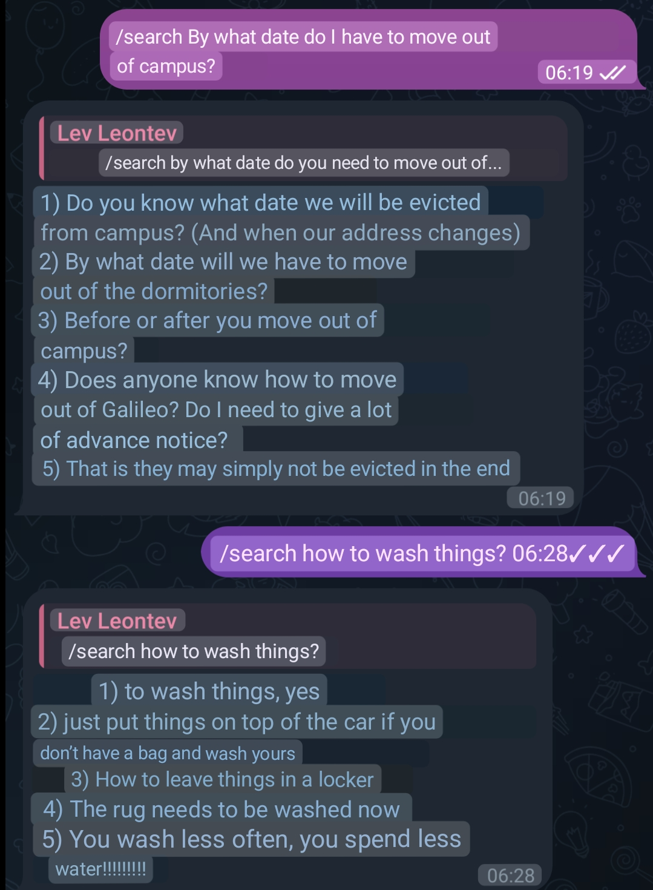
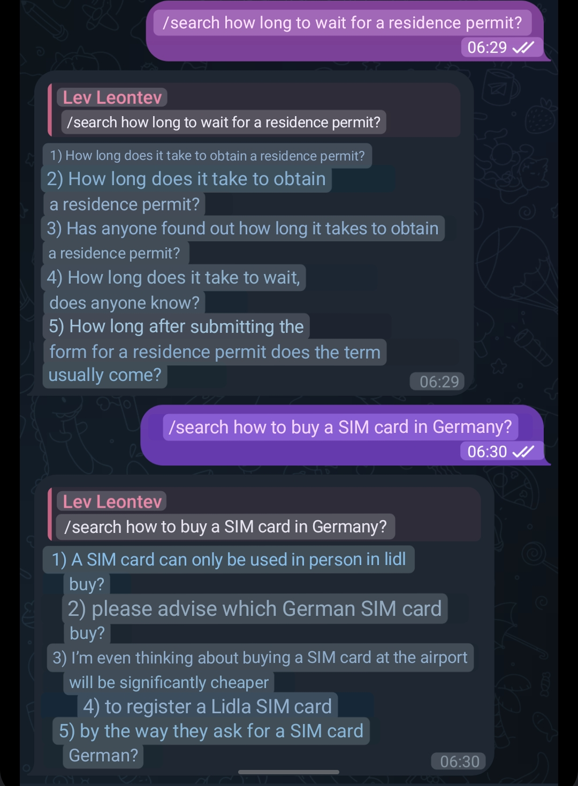

# TelegramSearchBot

This bot aims to provide better search in a Telegram chat than the built-in search.

## Method used

Uses [doc2vec](https://radimrehurek.com/gensim/models/doc2vec.html) using Gensim to find the top 20 results.
Then uses ChatGPT API in order to select the 5 best results and provides the link to the original message.

More specifically, we first tokenize the messages by removing punctuation and making words lowercase,
then perform stemming using [Snowball](https://www.nltk.org/_modules/nltk/stem/snowball.html),
then train Doc2Vec on vectors of size 350 (why that size exactly? manual grid search).

Then finding the most similar vectors (using cosine similarity) is trivial via, for example, a [k-d tree](https://en.wikipedia.org/wiki/K-d_tree).

After that to cherry-pick the best top 5 results, we use the ChatGPT API.

## Setup
Copy [token_example.json](token_example.json) and name it `token.json`.
You'll have to fill in all of its fields.
1) Register an application with Telegram [here](https://my.telegram.org/apps). Take `app_id` and `app_hash` from there.
2) Register a bot in Telegram via [@BotFather](https://t.me/botfather). Take `bot_token` from there.
3) Get an OpenAI key from [here](https://platform.openai.com/api-keys). Take `openai_token` from there. You'll need to top up the credit balance.

Now setup the Python dependencies by executing ```pip3 install -r requirements.txt```. 
Then you can run `python3 bot.py`.

Upon launching, the bot will ask you for the name of the chat to train on and the language of that chat.
Then it will perform the training of the model.
Afterwards, send "/search {query}" to the bot in order to find a message in the chat.
The bot will send the links the relevant messages.

If you want to restrict your bot to a few chats, add the allowed Chat IDs (numeric, one on each line) into [allowed_chats.txt](allowed_chats.txt)

## Examples


